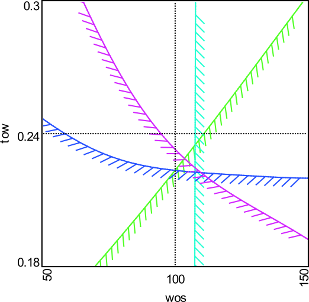
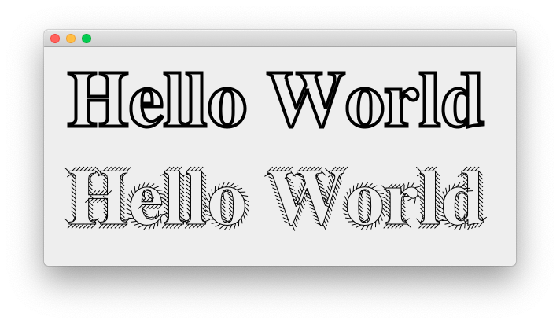

# HatchedStroke

Long ago (~January 2006), I needed to produce quality graphics in Java to represent a constrained
optimization problem.  In this style, a constraint line is drawn with hatches
marking the "*bad*" side of the line.

To accomplish this, I implemented a custom Graphics2D Stroke that would draw hatches
along a line as the line itself was drawn.  Consequently, anything drawn with Java's
Graphics2D could use this custom line style.

A test program is included to demonstrate the custom stroke.  When run, it should
produce a window displaying Hello World with a conventional line stroke and also
with the hatched stroke.

## Ports to Other Languages

My need to generate quality graphics representing constrained optimization problems
keeps coming back.

In December 2006, pained by witnessing my students drawing hatches on lines with
PhotoShop, I wrote a
[Matlab version of this tool](https://github.com/ramcdona/HatchedContours) including
a helper for working with constraint data.  Versions of this have been available on
the
[Matlab File Exchange](https://www.mathworks.com/matlabcentral/fileexchange/29121-hatched-lines-and-contours?s_tid=srchtitle)
since 2010.

Most recently (March 2019), my team once again needed to visualize constrained design
spaces; this time in Python and Matplotlib.  So, in a bit of déjà vu, I wrote the
same tool again.  This time I submitted it to the upstream project, and after
traversing their contribution process, it was accepted for inclusion in Matplotlib
version 3.4.0 -- first released in March 2021.

Similar to the Java approach, it is implemented as a PathEffect in Matplotlib and should
be applicable to any line drawn.  Update your Matplotlib to 3.4.0 or newer and you'll
have this capability.  Check out their example gallery for some documentation and examples
on using [TickedStroke](https://matplotlib.org/stable/gallery/images_contours_and_fields/contours_in_optimization_demo.html).

## Different Strokes

There are other custom strokes out there that accomplish some pretty neat things.
If you want to search for them, I recommend searching Google with:
`"implements Stroke" java site:github.com`

This custom stroke and the test case were inspired by David Flanagan's examples
from Java Examples in a Nutshell 2e.

Jerry Huxtable gives some [fun examples](http://www.jhlabs.com/java/java2d/strokes/)
including writing text along a path.

Jeremy Wood provides an [artistic brush stroke](https://javagraphics.blogspot.com/2007/04/strokes-brush-stroke.html)
that is super cool.

The gis / mapping / cartography community are a great source of custom strokes.  Also,
look to the 2D CAD folks although most common CAD line styles can be accomplished with
BasicStroke dash patterns.

## License

This software is Copyright (c) Robert A. McDonald 2006-2021 and is released under the terms specified in the [license](license.txt).
